# **_Farm Animal Quiz_**

Farm Animal Quiz is an interactive quiz website design for small children’s/juniors, where can test their knowledge regarding farm animals. It is designed to entertain children’s and their parents. Also the parents and teachers  can use the little quiz to help the little ones to learn the common farm animals. The little quiz contain images and sounds which helps children to learn easily all the animal in an interactive way.

[View the live project here.](https://ionelasabinamacovei.github.io/farm-animal-quiz/)

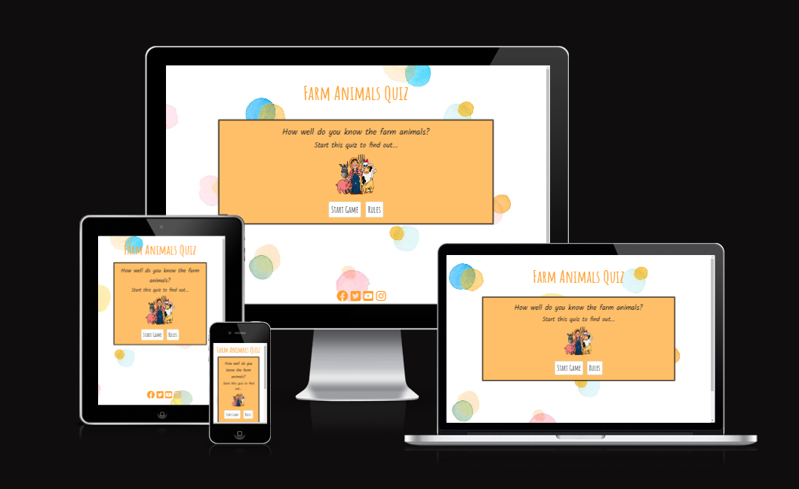

# Contents

* [**User Experience UX**](<#user-experience-ux>)
    * [Wireframes](<#wireframes>)
    * [Site Structure](<#site-structure>)
    * [Design](<#design>)
      * [Colour Scheme](<#colour-scheme>)
* [**Current Features**](<#current-features>)
    * [Home Page](<#home-page>)
    * [Rules Page](<#rules-page>)
    * [Quiz Page](<#quiz-page>)
    * [End Page](<#end-page>)
* [**Testing**](<#testing>)
* [**Isues and Bugs**](<#issues-and-bugs>)
* [**Deployment**](<#deployment>)
* [**Credits**](<#credits>)
    * [**Content**](<#content>)
    * [**Media**](<#media>)
* [**Frameworks, Libraries & Programs Used**](<#frameworks,-libraries-&-programs-used>)

# User Experience (UX)

**First Time Visitor Goals**
1. As a First Time Visitor, I want to immediately understand the main purpose of the site. 
2. I want to find more information about the game and to be able to consult the game instructions. 
3. I would like to play a simple game, with a fairly short play time, but high entertaining value.
4. I want to see my final score.
5. I want to have fun and feel inclined to play it again or at a later time.

## Wireframes

The wireframes for the Farm Animal Quiz project were produced in Balsamiq.  There are frames for a desktop device.

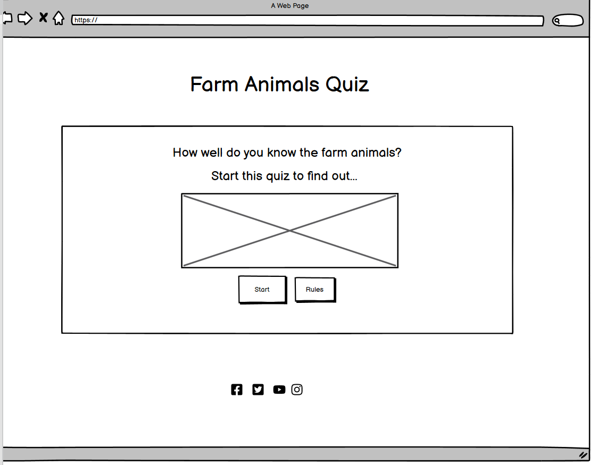
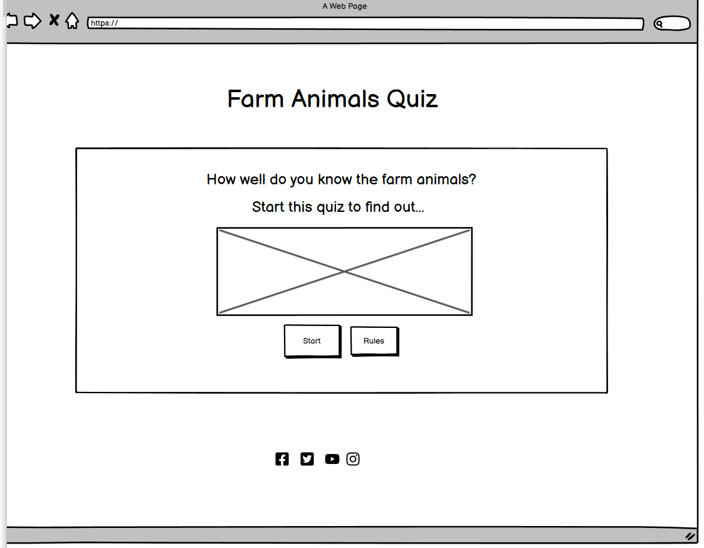
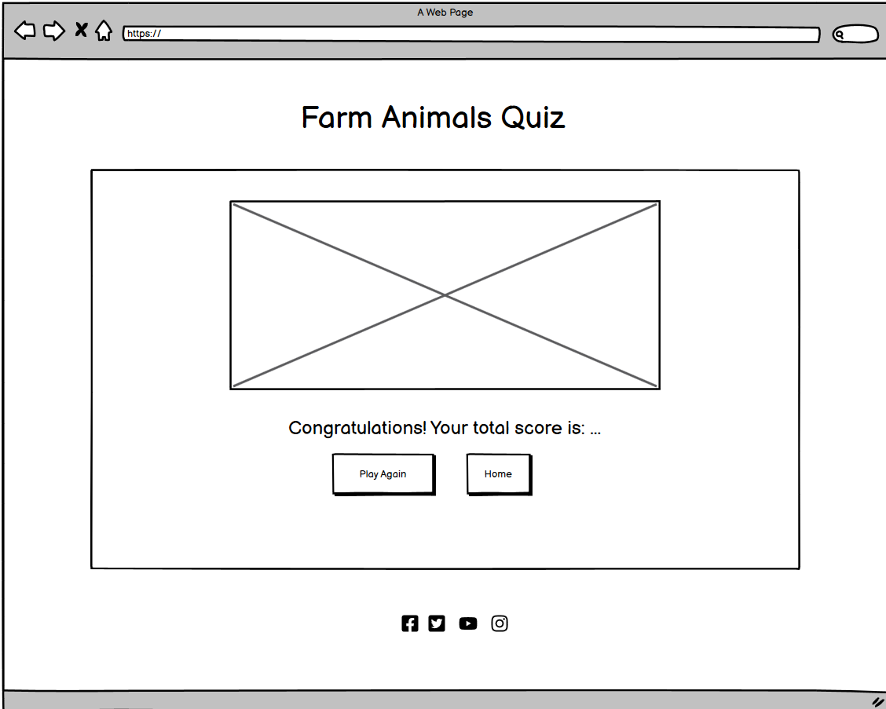

[Back to top](<#contents>)

## Site Structure

The game is free and it runs on the browser on a single page so the user can stay on the website and not navigate away, providing few steps for the user to make a decision to play the game.

The Farm Animal Quiz has been created within a single HTML page. The homepage is the initial default loading page with two buttons available to the user. 'Start' or 'Rules'. The 'Rules' button shows the rules on screen, and the 'Start' button starts the quiz. You can move through each page of the quiz via a 'Next' button and then once the quiz has finished, the user is taken to a Summary page where they are told their score, and given two more button options; 'Home', which takes them back to the homepage, or 'Play Again' which takes them back to the start of a new quiz.

## Design 

* ### Colour Scheme

The color scheme for this page was taken from [coolors](https://coolors.co/palette/ff9f1c-ffbf69-ffffff-cbf3f0-2ec4b6).
Some colours were adjusted accordingly to improve visibility.

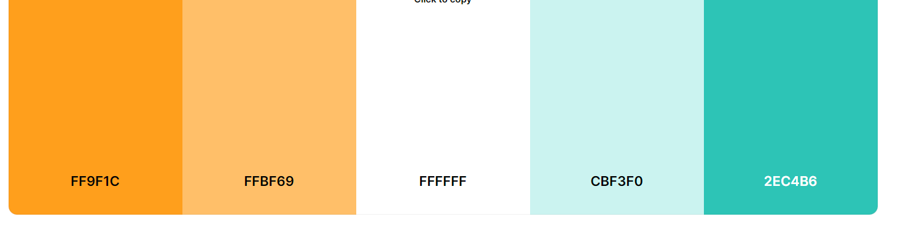

# Current Features

## Home Page

At the top of the website is the main title and an introduction to the quiz. The game logo is displayed here. Underneath the quiz introduction, there are two buttons to choose from. A 'Rules' button and a 'Start Quiz' button. If the user clicks the 'Rules' button, the quiz introduction text is replaced by a set of rules, and only the 'Start Quiz' button remains.  If the user clicks the 'Start Button', the quiz introduction and the two buttons disappear, and are replaced with the Quiz Page. Also the page contain a footer section where are displayed the media links.

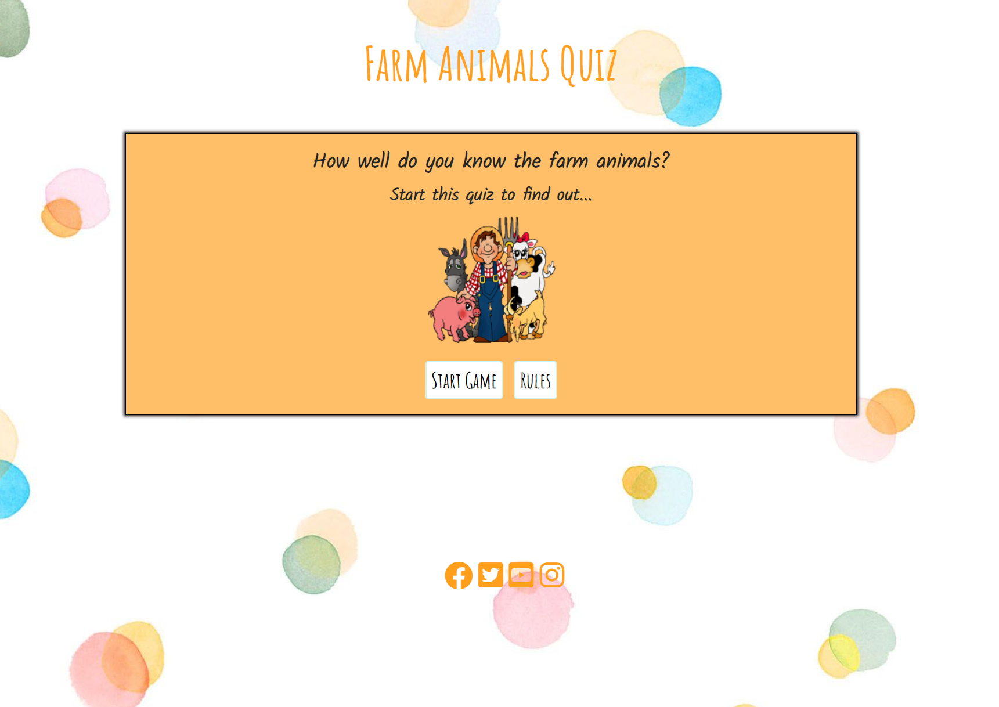

## Rules Page

If the user is unsure of how to play a quiz game, at the bottom of the Home Page they can select the 'Rules' button which will show them a set of simple instructions. Under the rules there is a button to start the game. 

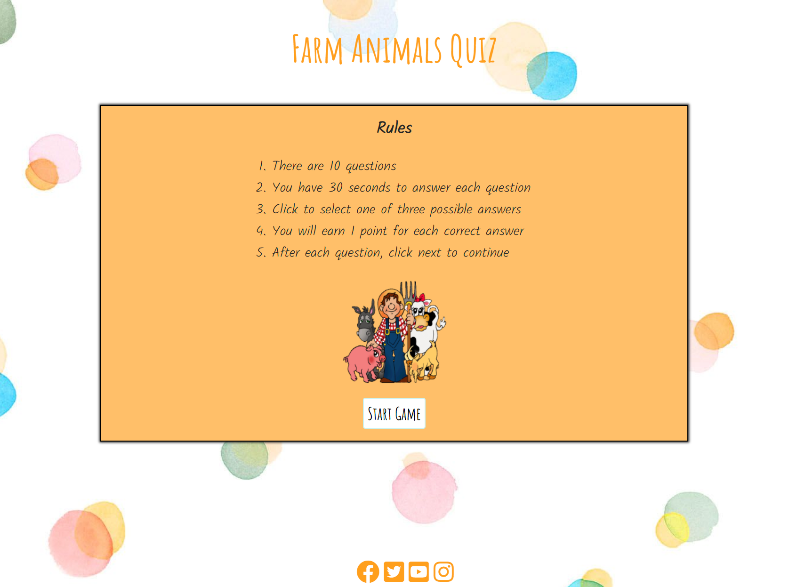

## Quiz Page

Once the user has selected the 'Start Quiz' button from either the Home page or Rules Page, the introduction, rules, logo and buttons disappear. The quiz area then becomes visible to the user and the game can begin. 

At the top of the quiz area, the user is told which question they are on out of a total of 10 questions.

An image is displayed which changes according to the particular question drawn. Under the image, the user can find a play and pause button which plays particular sounds for every question, also underneath the sound buttons the user can read the quiz question and three possible answers displayed in clickable buttons. Finally the user can see their score throughout the quiz. A countdown timer is displayed in the up-left of the page. The user is given 30 seconds to answer each question, and the countdown begins as soon as the question is displayed. If an answer button is clicked within the 30 seconds limit, the timer stops and the user is given feedback on their response as normal. If the timer runs out and no answer has been selected, the correct answer and two incorrect answers are highlighted, no points are awarded, and the next button is displayed to continue on to the next question

Once an answer has been selected, depending on which button is pressed, various things may or may not occur. If the user selects the correct answer, the selected answer button will turn green to indicate to the user that it's correct, the score will go up by 1 point, and a 'Next' button will appear to move on to the next question. If however the user selects an incorrect answer, the selected button will turn red, the correct answer will turn green to show which button the user should have chosen, the score does not change, and the 'Next' button will appear to move on to the next question. 

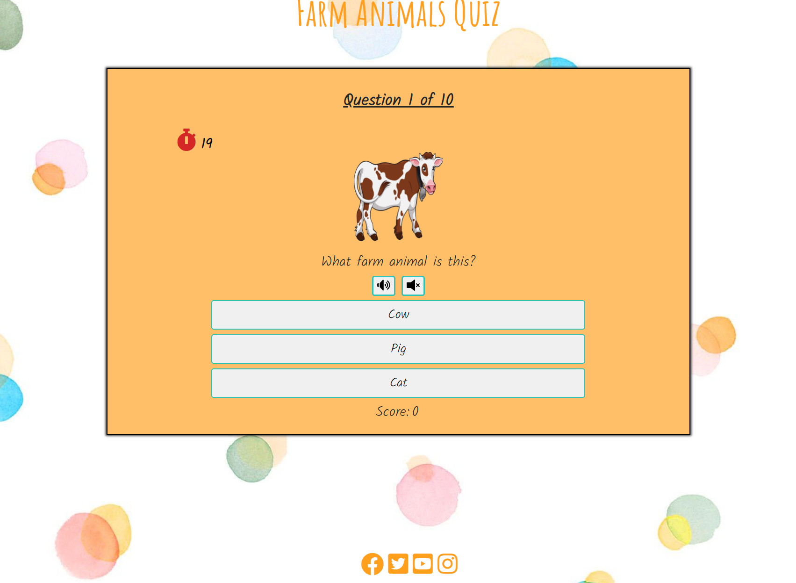

## End Page

Once 10 questions have been answered, when the user clicks the 'End' button the quiz is finished, the questions disappear and they are replaced by a summary of how well the user did. If they score more than 4 points, they will see a message congratulating them on their score. If the player gets 4 points or lower, they will receive a message of commiseration.

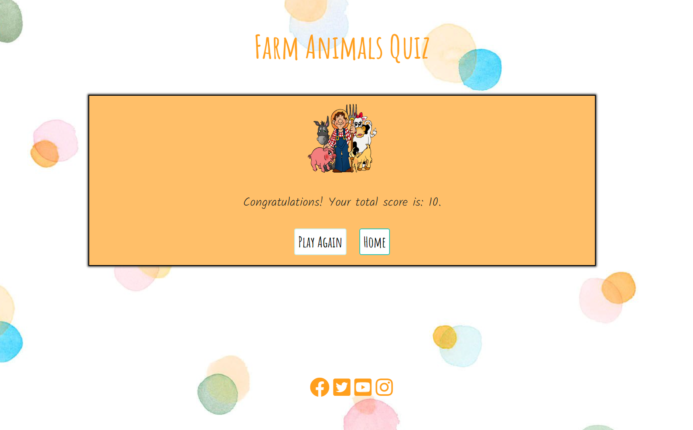
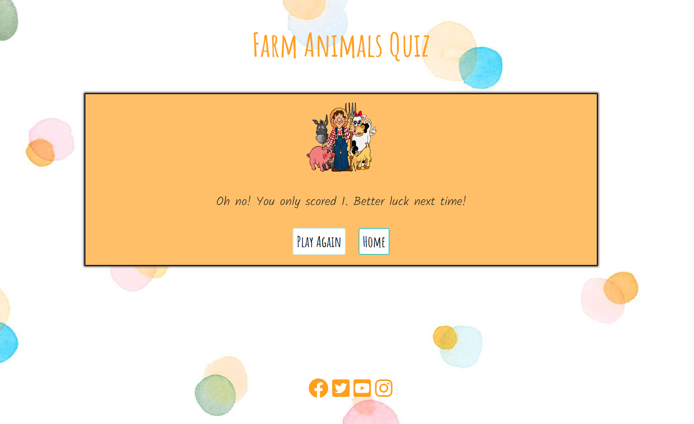

In both cases, the user has two button options for how to continue from this screen. They can select 'Play Again' which will reset the quiz, select a new set of questions, set their score back to zero and present them with a new question. Or they can select 'Home' which will take them back to the Home Page.

[Back to top](<#contents>)

# Testing

### User Testing

- The website works well on every other device and is responsive to different screen sizes.

- After deploying the site, the website was checked by friends and family on different devices.

- The site was tested on different browsers like Chrome, Edge and Firefox and had no issues.

- The footer links work perfectly and open on a new page.

- Once the form is submitted it displays a thank you message. The button on thank you page also works fine and takes the users back to home page.

### Manual Testing

- On the home page the logo is displayed and the buttons work as is needed. 
- The 'Start Button' open the quiz and the 'Rules Button' opens a new page with all the rules.
- On the rules page the button to start the quiz work well, will start the game.
- On the quiz page the answer buttons work well, the sound is played and paused from the play/pause buttons. Also the particular sounds and image are displayed as needed.
- The timer start to count-down when the quiz page starts.
- After the user choose an answer the next button is displayed and the score section shown the user score, and worked as intended.
- Depends on the score obtained by the user at the end of the quiz appear the correct message.

### Validator Testing

#### HTML
No errors were returned when passing through the official [W3C Markup Validator](https://validator.w3.org/).
The HTML validation passes without errors. 

- [W3C Markup Validator Results](https://validator.w3.org/nu/?doc=https%3A%2F%2Fionelasabinamacovei.github.io%2Ffarm-animal-quiz%2F).
 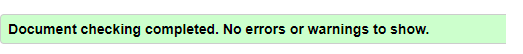.

#### CSS
No errors were found when passing through the official [W3C CSS Validator](https://jigsaw.w3.org/css-validator/).
The CSS validation passes without errors.

- [W3C CSS Validator Results](https://jigsaw.w3.org/css-validator/validator?uri=https%3A%2F%2Fionelasabinamacovei.github.io%2Ffarm-animal-quiz%2F&profile=css3svg&usermedium=all&warning=1&vextwarning=&lang=en).
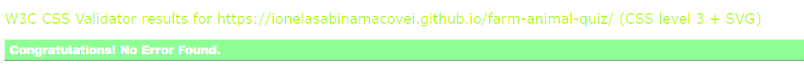.

#### JavaScript

No errors were found when passing through [JSHint](https://jshint.com).
JSHint was used to validate the JavaScript for the project. The code passed validation without errors and with one warning that we are using modern JavaScript features. JSHint does not provide a link to the results.

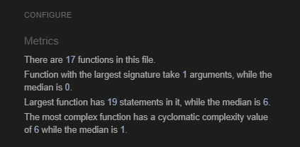.

### Performance and Accessibility Testing

The website was tested for performance and accessibilty using Lighthouse on google chrome's developer tools.

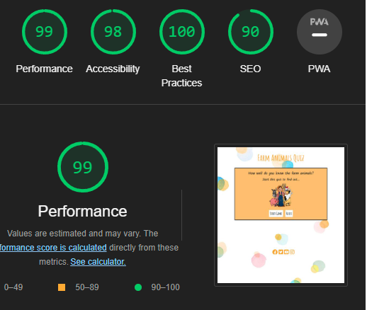.

# Issues and Bugs

1. 
- Expected - Sound button is expected to play sounds.
- Testing - Press the button to see if it is working.
- Result - Not sounds were played.
- Fix - Wire the button to the javaScript file by using getElementById. Creating a new variable with the document.getElementById and using the id of the button.

2. 
- Expected - Sound stop when the next button is pressed.
- Testing - Press the next button.
- Result - The sound continue to play.
- Fix - Fixed the bug by using addEventListener. Create the nextButton.addEventListener and setting the function when clicked the button audio will pause(audio.pause).

3. 
- Expected - Score to be incremented by one.
- Testing - Playing the game.
- Result - The score is incremented by 3.
- Fix - Removed the loop through the answer buttons and event listener, and instead created three separate event listeners; one for each answer button.

4. 
- Expected - If pressed the correct answer the button turns green and if incorrect the button turn red.
- Testing - Pressed the answer button.
- Result - The game doesn't actually tell them which answer was the correct one.
- Fix - Amended the function to also highlight the correct answer button in green even when a different button has been pressed. This adds to a better user experience overall.

5. 
- Expected - Play particular sounds for each quiz.
- Testing - Press the play button.
- Result - Playing the same sound.
- Fix - Fixed by using the setAstribute in function called displayOuestion and setting the right source and after adding particular sounds to the list questions.

[Back to top](<#contents>)

# Deployment

This website was deployed to GitHub Pages. The steps to deploy are:
- Log in to GitHub
- Go to the setting for this repository.
- Select pages in left hand navigation menu.
- From the source dropdown, select main branch and then press save.
- The site will be deployed now. It may take a few minutes to go live.

### Local Development
To fork this repository, follow these steps:
- Log in to GitHub
- Go to the repository
- On the top right corner, click on the button that says fork.

To clone this repository, follow the steps:
- Log in to GitHub
- Go to the repository
- Beside the gitpod button, it is code button
- Press the Code button and the chose one of the two cloning methods
- 1. The first one is by copping the link 
- 2. The second one is by downloading(at the botom) by pressing Download ZIP.

[Back to top](<#contents>)

# Credits
### Content

* The colour scheme was researched from the following websites:
https://coolors.co/palettes/trending
* The ideea on how to create a quiz game with javascript were found on: 
https://github.com/quiltingcode/disneysidekicks
https://github.com/adrinecl/milestone-project2
W3schools.com/howto/howto_js_toggle_hide_show.asp
https://www.geeksforgeeks.org/shuffle-or-randomize-a-list-in-java/
ttps://sebhastian.com/shuffle-array-javascript/#:~:text=A%20JavaScript%20array%20elements%20can,using%20the%20sort()%20method.&text=The%20JavaScript%20Array%20sort(),value%20returned%20by%20that%20function.

### Media
* The images and background was reaserched from the following websites:
https://www.pngwing.com/en/search?q=ball
https://imgbin.com/free-png/ball
https://fondosmil.com/disney
https://favicon.io/

* The sounds was researched from the following website:
https://freeanimalsounds.org/farm-animals/

# Frameworks, Libraries & Programs Used

- [Google Fonts](https://fonts.google.com/ "Link to Google Fonts") was used to import the fonts "Lato", and "Oswald".
- [Font Awesome](https://fontawesome.com/ "Link to FontAwesome") was used for the several icons.
- [GitPod](https://gitpod.io/ "Link to GitPod homepage") was used for writing, commiting, and pushing code.
- [GitHub](https://github.com/ "Link to GitHub")

[Back to top](<#contents>)

