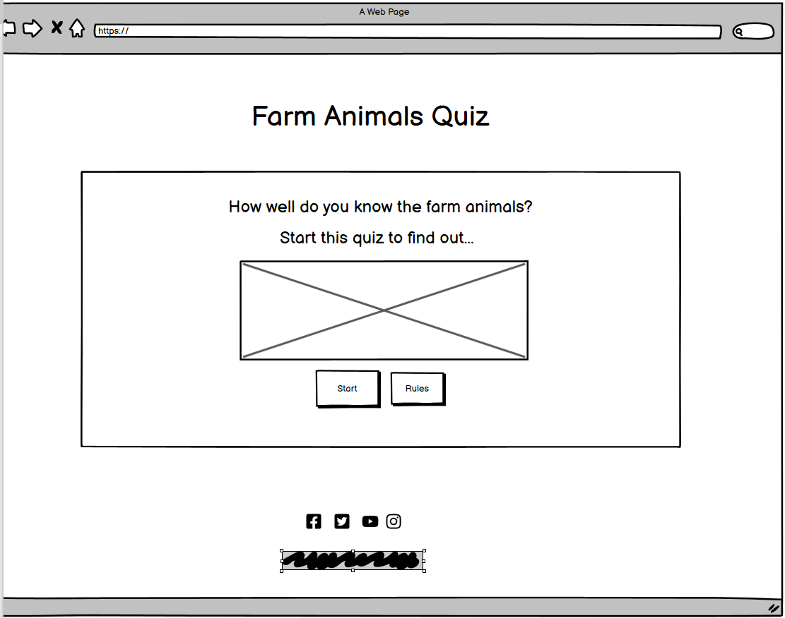
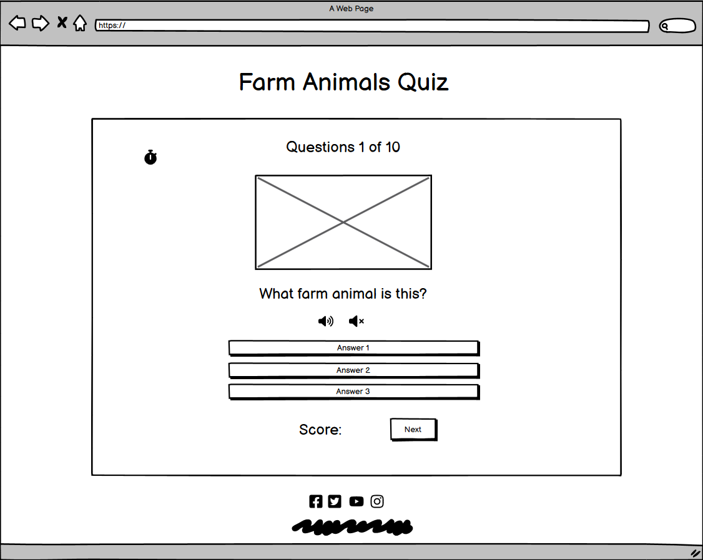
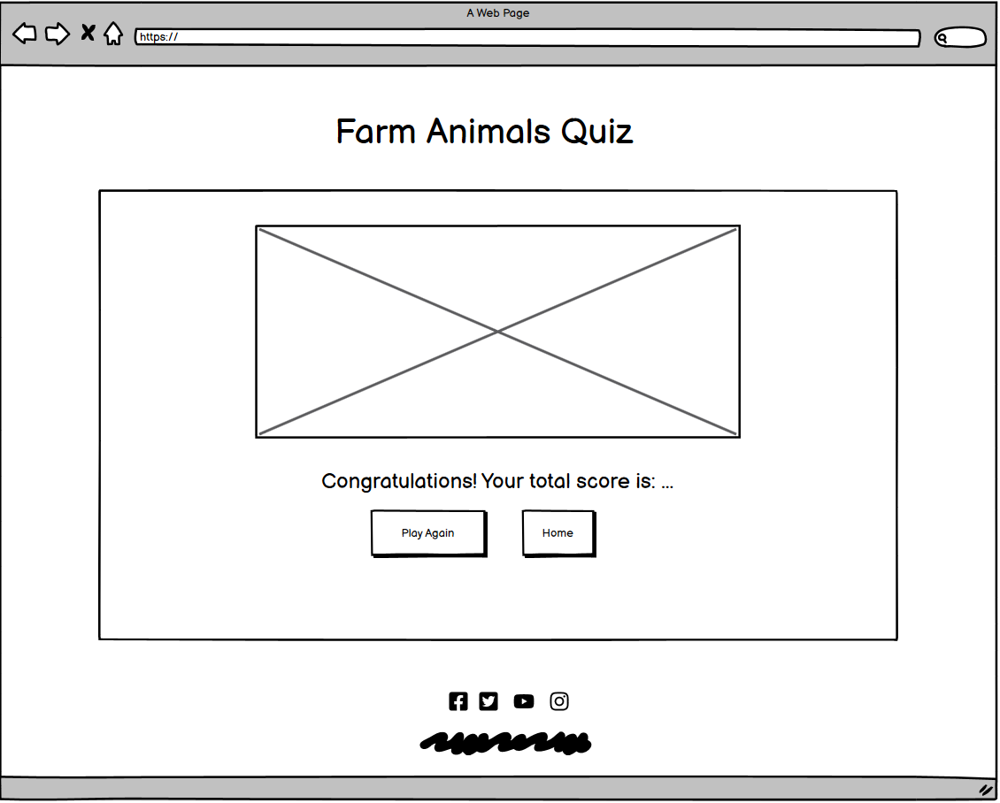

# **_Farm Animal Quiz_**

Farm Animal Quiz is an interactive quiz website design for small childrens/juniors, where can test their knoledge regarding farm animals. It is designed to entertain childrens and their parents. Also the parents and teachers  can use the little quiz to help the little ones to learn the common farm animals. The little quiz contain images and sounds which helps children to learn easily all the animal in an interactive way.

[View the live project here.](https://adrinecl.github.io/milestone-project2/)

# Contents

* [**User Experience UX**](<#user-experience-ux>)
    * [Wireframes](<#wireframes>)
    * [Site Structure](<#site-structure>)
    * [Design](<#design>)
      * [Colour Scheme](<#colour-scheme>)
* [**Current Features**](<#current-features>)
    * [Home Page](<#home-page>)
    * [Rules Page](<#rules-page>)
    * [Quiz Page](<#quiz-page>)
    * [End Page](<#end-page>)
* [**Testing**](<#testing>)
* [**Deployment**](<#deployment>)
* [**Credits**](<#credits>)
    * [**Content**](<#content>)
    * [**Media**](<#media>)
* [**Technologies Used**](<#technologies-used>)

# User Experience (UX)

**First Time Visitor Goals**
1. As a First Time Visitor, I want to immediately understand the main purpose of the site. 
2. I want to find more information about the game and to be able to consult the game instructions. 
3. I would like to play a simple game, with a fairly short play time, but high entertaining value.
4. I want to see my final score.
5. I want to have fun and feel inclined to play it again or at a later time.

## Wireframes

The wireframes for the Farm Animal Quiz project were produced in Balsamiq.  There are frames for a desktop device.

[Back to top](<#contents>)

## Site Structure

The game is free and it runs on the browser on a single page so the user can stay on the website and not navigate away, providing few steps for the user to make a decision to play the game.

The Farm Animal Quiz has been created within a single HTML page. The homepage is the initial default loading page with two buttons available to the user. 'Start' or 'Rules'. The 'Rules' button shows the rules on screen, and the 'Start' button starts the quiz. You can move through each page of the quiz via a 'Next' button and then once the quiz has finished, the user is taken to a Summary page where they are told their score, and given two more button options; 'Home', which takes them back to the homepage, or 'Play Again' which takes them back to the start of a new quiz.

## Design 

* ### Colour Scheme

The color scheme for this page was taken from [coolors](https://coolors.co/palette/ff9f1c-ffbf69-ffffff-cbf3f0-2ec4b6).
Some colours were adjusted accordingly to improve visibility.

# Current Features

## Home Page

At the top of the website is the main title and an introduction to the quiz. The game logo is displayed here. Underneath the quiz introduction, there are two buttons to choose from. A 'Rules' button and a 'Start Quiz' button. If the user clicks the 'Rules' button, the quiz introduction text is replaced by a set of rules, and only the 'Start Quiz' button remains.  If the user clicks the 'Start Button', the quiz introduction and the two buttons disappear, and are replaced with the Quiz Page. Also the page contain a footer saction where are displayed the media links.

## Rules Page

If the user is unsure of how to play a quiz game, at the bottom of the Home Page they can select the 'Rules' button which will show them a set of simple instructions. Under the rules there is a button to start the game. 

## Quiz Page

Once the user has selected the 'Start Quiz' button from either the Home page or Rules Page, the introduction, rules, logo and buttons disappear. The quiz area then becomes visible to the user and the game can begin. 

At the top of the quiz area, the user is told which question they are on out of a total of 10 questions.

An image is displayed which changes according to the particular question drawn. Under the image, the user can find a play and pause button which plays particular sounds for every question,also underneath the sound buttons the user can read the quiz question and three possible answers displayed in clickable buttons. Finally the user can see their score throughout the quiz. A countdown timer is displayed in the up-left of the page. The user is given 30 seconds to answer each question, and the countdown begins as soon as the question is displayed. If an answer button is clicked within the 30 seconds limit, the timer stops and the user is given feedback on their response as normal. If the timer runs out and no answer has been selected, the correct answer and two incorrect answers are highlighted, no points are awarded, and the next button is displayed to continue on to the next question

Once an answer has been selected, depending on which button is pressed, various things may or may not occur. If the user selects the correct answer, the selected answer button will turn green to indicate to the user that it's correct, the score will go up by 1 point, and a 'Next' button will appear to move on to the next question. If however the user selects an incorrect answer, the selected button will turn red, the correct answer will turn green to show which button the user should have chosen, the score does not change, and the 'Next' button will appear to move on to the next question. 

## End Page

Once 10 questions have been answered, when the user clicks the 'End' button the quiz is finished, the questions disappear and they are replaced by a summary of how well the user did. If they score more than 4 points, they will see a message congratulating them on their score. If the player gets 4 points or lower, they will receive a message of comiseration.

In both cases, the user has two button options for how to continue from this screen. They can select 'Play Again' which will reset the quiz, select a new set of questions, set their score back to zero and present them with a new question. Or they can select 'Home' which will take them back to the Home Page.

[Back to top](<#contents>)

# Testing

### User Testing

- The website works well on every other device and is responsive to different screen sizes.

- After deploying the site, the website was checked by friends and family on different devices.

- The site was tested on different browsers like Chrome, Edge and Firefox and had no issues.

- The footer links work perfectly and open on a new page.

- Once the form is submitted it displays a thank you message. The button on thank yo page also works fine and takes the users back to home page.

### Manual Testing

- On the home page the logo is diplayed and the buttons work as is needed. 
- The 'Start Button' open the quiz and the 'Rules Button' opens a new page with all the rules.
- On the rules page the button to start the quiz work well, will start the game.
- On the quiz page the answer buttons work well, the sound is played and pused from the play/pause buttons. Also the particular sounds and image are displayed as needed.
- The timer start to count-down when the quiz page starts.
- After the user choose an answer the next button is displaied and the score section swhon the user score, and worked as intended.
- Depends on the score obtained by the user at the end of the quiz appear the correct message.

### Validator Testing
